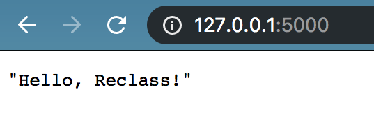

# toynet-flask
Backend service of ToyNet emulator and learning platform

# Requirements
The following tutorial applies to Linux / MacOS development environment. Visit Windows documentation [here](documentation/windows.md).

## Python

Install Python3.7

## venv
Create a project folder and a venv folder within:
```
$ git clone https://github.com/Project-Reclass/toynet-flask
$ cd toynet-flask
$ python3 -m venv venv
```

Before you work on your project, activate the corresponding environment:
```
$ . venv/bin/activate
```

Install Python Requirements (add new requirements via `pip3 freeze > requirements.txt.`)
```
$ pip3 install -r requirements.txt
```

You can exit this virtual environment anytime via running:
```
$ deactivate
```

More information [here](https://docs.python.org/3/library/venv.html)


From there, make sure to build the toynet docker image from the `toynet_mininet` directory and tag it with the same tag you use in the below environment variable for `TOYNET_IMAGE_TAG`. First you will need to download mininet. You can do this by initializing the submodule.
```
$ cd toynet_mininet
$ git submodule update --init --recursive
```
You will then need to build the image.  The default way, which will work with the Makefile here, is to go into the toynet_mininet submodule and run:
```
$ make test-image
```
if you want a test image. If you want a production image then run:
```
$ make prod-image
```
also in the `toynet_mininet` directory.

**Note:** See the [toynet_mininet README](https://github.com/Project-Reclass/toynet-flask/blob/main/toynet_mininet/README.md) for more information on building and developing `toynet_mininet`.

# Run the service
Make sure that, if you are testing anything related to sessions or network emulation, that you build the appropriate image (dev or prod) in `toynet-mininet`.

The following tutorial applies to Linux / MacOS development environments. Visit Windows documentation [here](documentation/windows.md).

```
# populate environment variables for testing
$ source instances/env-dev

# Populate environment variables for production
$ source instances/env-prod

# creates instance/toynet.sqlite
$ flask init-db 
Initialized the database.

$ flask run
 * Serving Flask app "flasksrc" (lazy loading)
 * Environment: development
 * Debug mode: on
 * Running on http://127.0.0.1:5000/ (Press CTRL+C to quit)
 * Restarting with stat
 * Debugger is active!
 * Debugger PIN: 220-725-712
 ```

Go to: `http://127.0.0.1:5000/`
<p align="center"> <kbd>  </kbd> </p>

# Makefile
The `Makefile` facilitates common workflows, run `make help` for detailed instructions.
You can use it to run everything in Docker containers, as opposed to running Flask locally as described above.

# Swagger API Documentation

Visit [swagger documentation](documentation/swagger.md) to generate living documentation about available API endpoints alongside your flask instance.

# Test the Service

Visit [testing documentation](documentation/testing.md) to learn how to unit test, run manual tests in development, and query SQLite files.

# Dependencies

This project was created using:
- [Pallet Projects Flask Tutorial](https://flask.palletsprojects.com/en/1.1.x/) for application structure and SQLite database (will become PostgreSQL)
- [Flask-RESTful](https://flask-restful.readthedocs.io/en/latest/quickstart.html) for Flask-native restful API
- [Pallet Projects Testing Tutorial](https://flask.palletsprojects.com/en/1.1.x/testing/) for pytest
- [Swagger](https://swagger.io/) for autogenerated API documentation
- [Argon2](https://argon2-cffi.readthedocs.io/en/stable/argon2.html) for password hashing
- [User Authentication & Authorization Tutorial](https://dev.to/paurakhsharma/flask-rest-api-part-3-authentication-and-authorization-5935), [Using JWT in pytest Stack Overflow](https://stackoverflow.com/questions/46846762/flask-jwt-extended-fake-authorization-header-during-testing-pytest) for authentication / authorization
- [Marshmallow](https://marshmallow.readthedocs.io/en/stable/index.html) & [Marshmallow Tutorial](https://www.cameronmacleod.com/blog/better-validation-flask-marshmallow) for parsing REST request body

# Troubleshooting

**Q: How do I use a table I added in `schema.sql` or `seed_data/<resource>.sql`?**<br/>
A: Delete instance/toynet.sqlite and run flask init-db again.

**Q: How do I get rid of a table?**<br/>
A: Delete `instance/toynet.sqlite` and run `flask init-db` again.

**Q: I added a test file but it isn't being picked up by pytest**<br/>
A: Make sure the file is named `test_***.py`

# FYIs

**1. We have not rigorously tested different `USER_GROUP_ID`s.**


# Contributors

* Tay Nishimura
* John Chung
* Arthur Lacey
* Blaze Bissar
* Shaili Smith
* Yujing Gao
* Berkan Yilmaz
