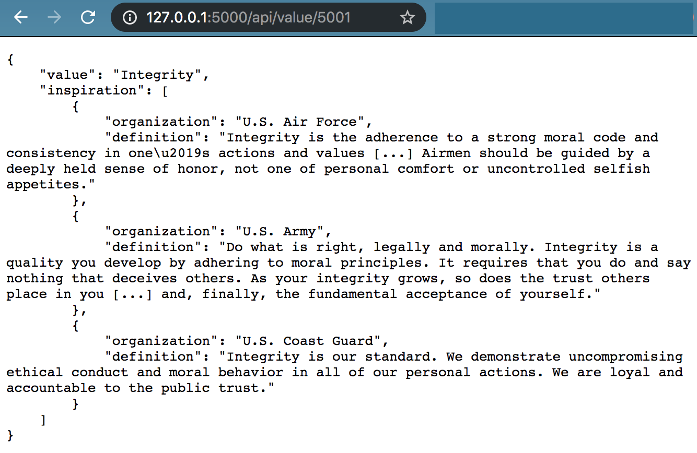
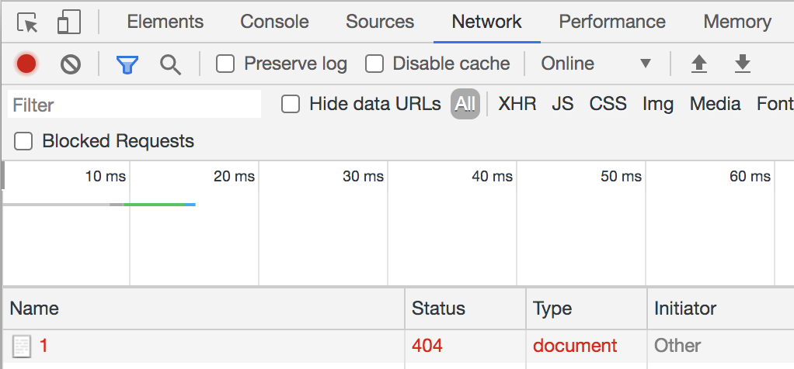

# toynet-flask
Backend service of ToyNet emulator and learning platform

Created with:
- https://flask.palletsprojects.com/en/1.1.x/ for application structure and SQLite database (will become PostgreSQL)
- https://flask-restful.readthedocs.io/en/latest/quickstart.html for Flask

# Requirements

## Python

Install Python3.7

## venv
Create a project folder and a venv folder within:

Linux / MacOS:
```
$ mkdir myproject
$ cd myproject
$ python3 -m venv venv
```

On Windows:
```
$ py -3 -m venv venv
```

Before you work on your project, activate the corresponding environment:

Linux / MacOS:
```
$ . venv/bin/activate
```

On Windows:
```
> venv\Scripts\activate
```

Install Python Requirements (add new requirements via `pip3 freeze > requirements.txt.`)
```
$ pip3 install -r requirements.txt
```

You can exit this virtual environment anytime via running:
```
$ deactivate
```

More information [here](https://docs.python.org/3/library/venv.html)

# Run the service

MacOS / Linux:
```
$ export FLASK_APP=flasksrc

# restarts server after code changes
$ export FLASK_ENV=development

# creates instance/flaskr.sqlite
$ flask init-db 
Initialized the database.

$ flask run
 * Serving Flask app "flasksrc" (lazy loading)
 * Environment: development
 * Debug mode: on
 * Running on http://127.0.0.1:5000/ (Press CTRL+C to quit)
 * Restarting with stat
 * Debugger is active!
 * Debugger PIN: 220-725-712
 ```

Windows:
```
> set FLASK_APP=flasksrc
> set FLASK_ENV=development
> flask init-db
> flask run
```

Windows PowerShell:
```
> $env:FLASK_APP = "flasksrc"
> $env:FLASK_ENV = "development"
> flask init-db
> flask run
```

Go to: `http://127.0.0.1:5000/`
<br/><br/>

Go to: `http://127.0.0.1:5000/values/5001`
<br/><br/>
Open Network tab of Chrome DevTools (right click screen & click "Inspect")
<br/><br/>

Go to: `http://127.0.0.1:5000/values/1`
<br/><br/>
Open Network tab of Chrome DevTools (right click screen & click "Inspect")
<br/><br/>

# Troubleshooting

**Q: How do I send REST calls to my application?**<br/>
A: You can use something like [Postman](https://www.postman.com/downloads/) ([tutorial](https://learning.postman.com/docs/sending-requests/requests/)) or [Insomnia](https://insomnia.rest/) ([tutorial](https://support.insomnia.rest/article/11-getting-started)).

**Q: How do I use a table I added in `schema.sql` or `seed_data/<resource>.sql`?**<br/>
A: Delete instance/flaskr.sqlite and run flask init-db again.

**Q: How do I get rid of a table?**<br/>
A: Delete `instance/flaskr.sqlite` and run `flask init-db` again.
