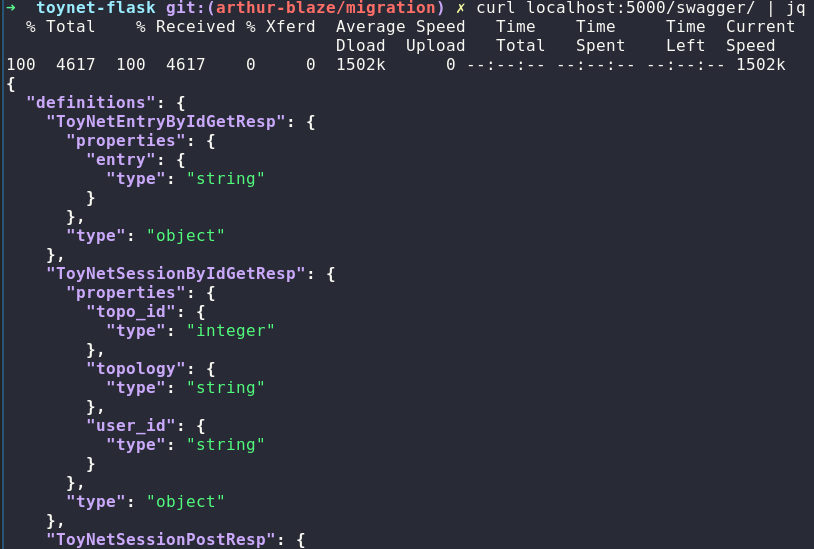
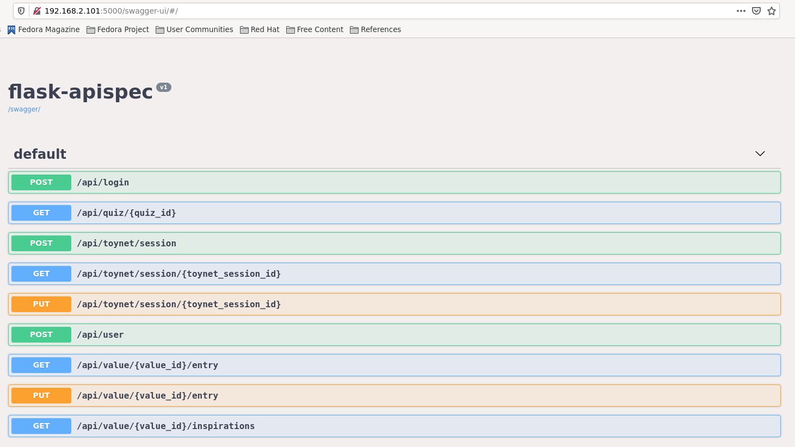
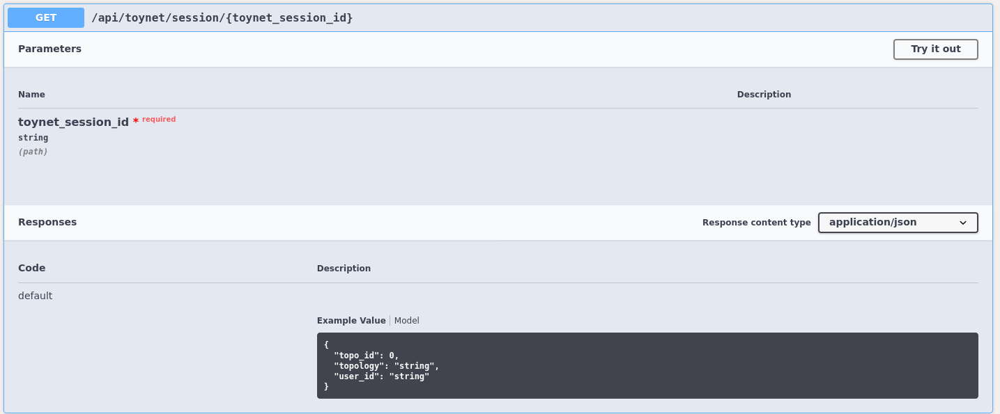
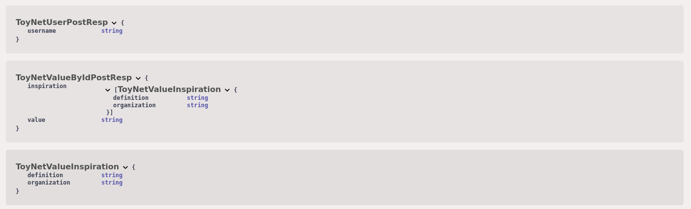

# Swagger API Documentation

Swagger is a useful tool that will automate our API documentation as well as
facilitate arguments checking for missing values passed to Flask.
In order to make use of Swagger you must do five things:
1. When modifying the `__init__.py` to include your new API endpoints, also add
   a line that registers them with Swagger:
```python
docs.register(YourApiEndpointClass)
```
2. Make sure that your source file imports:
```python
from marshmallow import Schema, fields, ValidationError
from flask_apispec import marshal_with, MethodResource
from flask import request # if you are loading fields from a POST body, for instance
```
3. Ensure that your class (`YourApiEndpointClass` above) inherits from
   `MethodResource` instead of `Resource`
4. Define your request/response schemas, specifically the fields that are
   present and their types. You can look at the beginning of
   `flasksrc/session.py` for examples. If a field is required in a request (not
   a response) you can specify `required=True`.
5. For methods using the schema for the HTTP request, add the decorator
   `@marshall_with(YourApiEndpointClassHttpMethodSchema)` that you defined for
   it

A good example file is `flasksrc/sessions.py`.

## Viewing API Specification
After running your Flask deployment, you will be able to vie the raw JSON
specification at `localhost:5000/swagger`
If you want to have a more graphical depiction of the specification, you can
browse to `localhost:5000/swagger-ui`

One approach is to curl the endpoint and pipe the JSON output into `jq` for
syntax-highlighted output:
```bash
curl http://localhost:5000/swagger | jq
```
<p align="center"> <kbd>  </kbd> </p>

You can also browse to the url:
<p align="center"> <kbd>  </kbd> </p>
From here, you can click on resources for additional information in a more visual interface:
<p align="center"> <kbd>  </kbd> </p>
You can also scroll to the bottom and view the model specifications, expanding fields as needed:
<p align="center"> <kbd>  </kbd> </p>

After writing your specification schemas, marking the endpoints to be
documented, and properly adding decorators and parent classes to the API
resources, you should confirm that the Swagger documentation matches what you
expect at these two resources.

