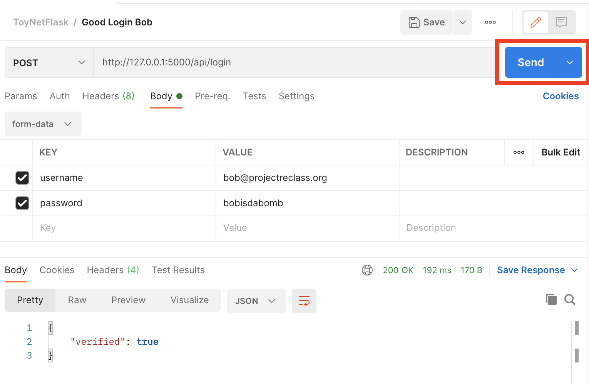

# Testing

## REST Calls through Chrome Devtools

Go to: `http://127.0.0.1:5000/api/value/5001`
<p align="center"> <kbd>  </kbd> </p>
Open Network tab of Chrome DevTools (right click screen & click "Inspect")
<p align="center"> <kbd>  </kbd> </p>

Go to: `http://127.0.0.1:5000/api/value/1`
<p align="center"> <kbd>  </kbd> </p>
Open Network tab of Chrome DevTools (right click screen & click "Inspect")
<p align="center"> <kbd>  </kbd> </p>

## REST Calls where Body needs to be specified

To send REST calls to local application, you can use something like [Postman](https://www.postman.com/downloads/) ([tutorial](https://learning.postman.com/docs/sending-requests/requests/)) or [Insomnia](https://insomnia.rest/) ([tutorial](https://support.insomnia.rest/article/11-getting-started)).

For Postman, you will need to create a personal account with your email.
Once you are logged in, you can use

<p align="center"> <kbd>  </kbd> </p>

<p align="center"> <kbd>  </kbd> </p>

You can then use the `Body` tab to provide a JSON key-value set.

<p align="center"> <kbd>  </kbd> </p>

<p align="center"> <kbd>  </kbd> </p>


## Unit Testing

Run our unit tests from the root directory:

```
$ pytest -v
```

## Making queries directly to SQLite

<p align="center"> <kbd>  </kbd> </p>

Becuase we are using SQLite in development, we can upload a snapshot of the `toynet-flask/instance/toynet.sqlite` file into an online SQLite viewer such as https://inloop.github.io/sqlite-viewer/ to run queries on it.

<p align="center"> <kbd>  </kbd> </p>