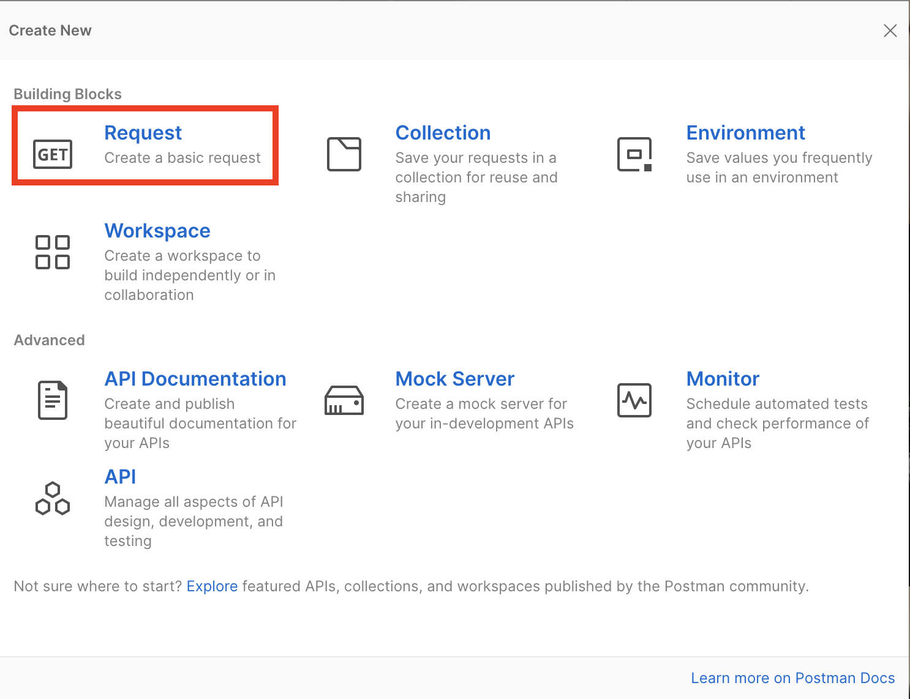
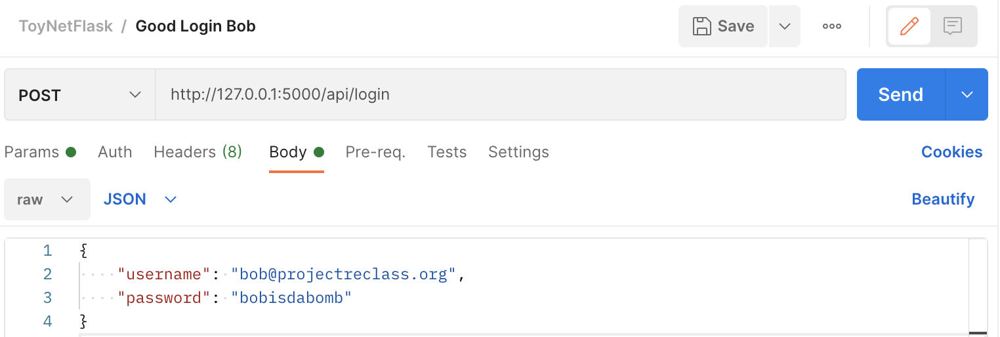

# Testing

## REST Calls through Chrome Devtools

Go to: `http://127.0.0.1:5000/api/value/5001`
<p align="center"> <kbd>  </kbd> </p>
Open Network tab of Chrome DevTools (right click screen & click "Inspect")
<p align="center"> <kbd>  </kbd> </p>

Go to: `http://127.0.0.1:5000/api/value/1`
<p align="center"> <kbd>  </kbd> </p>
Open Network tab of Chrome DevTools (right click screen & click "Inspect")
<p align="center"> <kbd>  </kbd> </p>

## Manually Testing Complex REST APIs

To send REST calls with complex body or authentication structures, you can use [Postman](https://www.postman.com/downloads/) ([tutorial](https://learning.postman.com/docs/sending-requests/requests/)) or [Insomnia](https://insomnia.rest/) ([tutorial](https://support.insomnia.rest/article/11-getting-started)) to construct the queries. For development, run the application locally using `flask run`, and set your target to `https://127.0.0.7:5000/<your api endpoint>`.

For Postman, you will need to create a personal account with your email.
Once you are logged in, you can use

<p align="center"> <kbd>  </kbd> </p>

<p align="center"> <kbd>  </kbd> </p>

### (CASE 1) Body needs to be specified

You can then use the `Body` tab to provide a JSON key-value set.

<p align="center"> <kbd>  </kbd> </p>

<p align="center"> <kbd>  </kbd> </p>

### (CASE 2) Auth Token required (JWT)

You can provide the JWT token (which you grab through the login API above) in the `Auth` tab with the option `Bearer Token`.

<p align="center"> <kbd>  </kbd> </p>

You can resuse the JWT token until it expires, and you can have different users access the API simultaneously.

<p align="center"> <kbd>  </kbd> </p>

## Unit Testing

Run our unit tests from the root directory:

```
$ pytest -v
```

<p align="center"> <kbd>  </kbd> </p>

When a unit test fails, the stack trace and any other error messages are printed to the console.

<p align="center"> <kbd>  </kbd> </p>

You can use print statements to debug, and `assert True` to stub tests.

<p align="center"> <kbd>  </kbd> </p>

Print statements only show up on the console for failed tests. You can purposefully fail a test `assert False` to see print statments.

<p align="center"> <kbd>  </kbd> </p>

## Making queries directly to SQLite

<p align="center"> <kbd>  </kbd> </p>

Becuase we are using SQLite in development, we can upload a snapshot of the `toynet-flask/instance/toynet.sqlite` file into an online SQLite viewer such as https://inloop.github.io/sqlite-viewer/ to run queries on it.

<p align="center"> <kbd>  </kbd> </p>

**Note:** This method is recommended for manual tests (running `flask run`) as the temporary SQLite files used for unit testing are automatically deleted at the end of the test.
