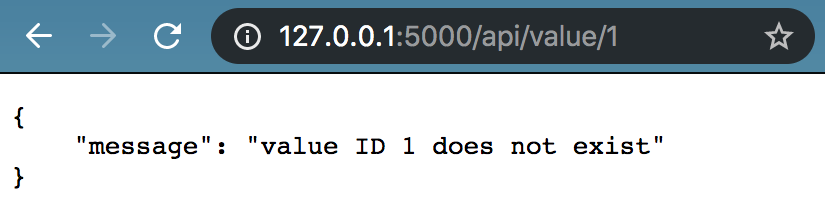

# Testing

## REST Calls through Chrome Devtools

Go to: `http://127.0.0.1:5000/api/value/5001`
<p align="center"> <kbd>  </kbd> </p>
Open Network tab of Chrome DevTools (right click screen & click "Inspect")
<p align="center"> <kbd>  </kbd> </p>

Go to: `http://127.0.0.1:5000/api/value/1`
<p align="center"> <kbd>  </kbd> </p>
Open Network tab of Chrome DevTools (right click screen & click "Inspect")
<p align="center"> <kbd>  </kbd> </p>

## Manually Testing Complex REST APIs

To send REST calls with complex body or authentication structures, you can use [Postman](https://www.postman.com/downloads/) ([tutorial](https://learning.postman.com/docs/sending-requests/requests/)) or [Insomnia](https://insomnia.rest/) ([tutorial](https://support.insomnia.rest/article/11-getting-started)) to construct the queries. For development, run the application locally using `flask run`, and set your target to `https://127.0.0.7:5000/<your api endpoint>`.

For Postman, you will need to create a personal account with your email.
Once you are logged in, you can use

<p align="center"> <kbd>  </kbd> </p>

<p align="center"> <kbd>  </kbd> </p>

Requests can be categorized in two groups - requests which can be made by anyone, and requests which require authorization. Both can be made through Postman!

### (CASE 1) Requests in which a body needs to be specified, but there is no authorization.

You can create your own user for logging in. This allows you to get authenticated for requests that require authorization! For example, getting or submitting your quiz scores should not be possible by users other than yourself. To do so, create a new `POST` request to the end point `http://127.0.0.1:5000/api/user` with the Body tab specified in raw `JSON` as follows:

```
{
    "username": "bob@projectreclass.org",
    "password": "bobisdabomb",
    "first_name": "Bob"
}
```
<p align="center"> <kbd>  </kbd> </p>

Once you press `Send`, the database should have stored your user information.

To check that you have created your user, `Save` your previous request (so you can run it again next time you're testing) and create a new `POST` request to the `http://127.0.0.1:5000/api/login` end point with the following body:
```
{
    "username": "bob@projectreclass.org",
    "password": "bobisdabomb"
}
```

<p align="center"> <kbd>  </kbd> </p>

<p align="center"> <kbd>  </kbd> </p>

A JWT is returned which you will need where you must be authorized to access other resources.

### (CASE 2) Requests in which a body may need to be specified and JWT authorization is required.

A user can only put information into the database if they provide the JWT token (which you grab through the login API above). Let's say you want to submit to ToyNet what Integrity means to you for the values submodule. The frontend will make a `PUT` request like the following to the `http://127.0.0.1:5000/api/value/5004/entry` endpoint:

```
{
    "quote": "Integrity is more than honesty."
}
```

<p align="center"> <kbd>  </kbd> </p>

Before you hit `Send`, go to the `Auth` tab and set the `Type` to `Bearer Token` (this is where `toynet-flask` will check for your JWT), and then insert the JWT you grabbed in your login in the `Token` text entry box.

<p align="center"> <kbd>  </kbd> </p>

Note: If you lost your last token, you can create another one with the same login request above.

Now you can hit `Send`! To check that your entry populated, send a `GET` request to the `http://127.0.0.1:5000/api/value/5004/entry` endpoint, again with your JWT.

<p align="center"> <kbd>  </kbd> </p>

You can resuse the JWT token until it expires, and you can have different users (Alice and Bob) access the API simultaneously with their respective usernames as long as each provides authentication!

<p align="center"> <kbd>  </kbd> </p>

## Unit Testing

Run our unit tests from the root directory:

```
$ pytest -v
```

<p align="center"> <kbd>  </kbd> </p>

When a unit test fails, the stack trace and any other error messages are printed to the console.

<p align="center"> <kbd>  </kbd> </p>

You can use print statements to debug, and `assert True` to stub tests.

<p align="center"> <kbd>  </kbd> </p>

Print statements only show up on the console for failed tests. You can purposefully fail a test `assert False` to see print statments.

<p align="center"> <kbd>  </kbd> </p>

## Making queries directly to SQLite

<p align="center"> <kbd>  </kbd> </p>

Becuase we are using SQLite in development, we can upload a snapshot of the `toynet-flask/instance/toynet.sqlite` file into an online SQLite viewer such as https://inloop.github.io/sqlite-viewer/ to run queries on it.

<p align="center"> <kbd>  </kbd> </p>

**Note:** This method is recommended for manual tests (running `flask run`) as the temporary SQLite files used for unit testing are automatically deleted at the end of the test.
